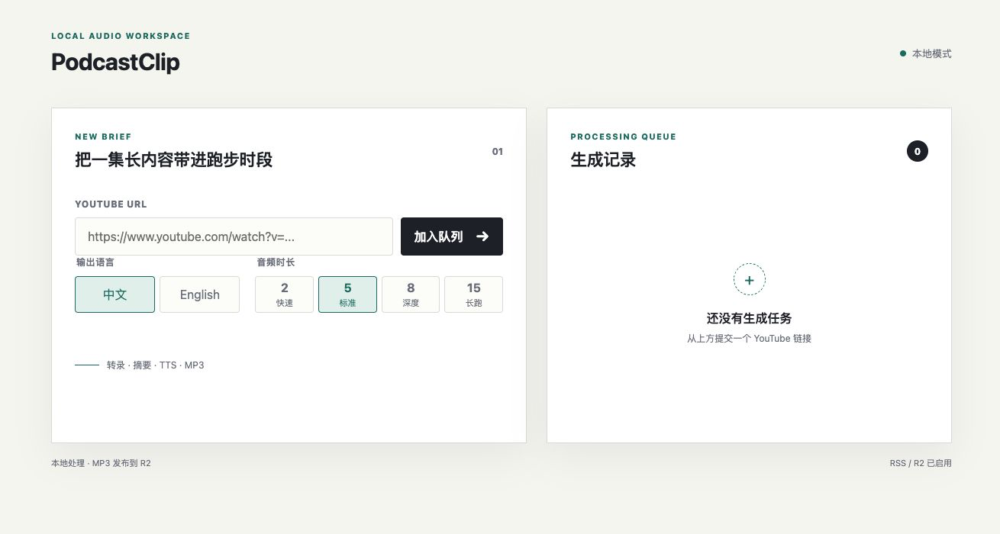

# PodcastClip

English | [简体中文](README.zh-CN.md)

**Turn a long YouTube podcast into a 2, 5, 8, or 15-minute audio brief and listen to it in Apple Podcasts.**

PodcastClip runs the production pipeline on your computer: it obtains captions or a transcript, writes a condensed Chinese or English script, generates an MP3, and publishes the episode to an RSS feed in your own Cloudflare R2 bucket. Add that feed to Apple Podcasts once; later briefs appear in the same show.

```text
YouTube podcast URL
        ↓
Captions or ASR transcript
        ↓
Structured summary and short script
        ↓
Chinese or English MP3
        ↓
Your R2 bucket: MP3 + artwork + feed.xml
        ↓
Apple Podcasts on iPhone / Apple Watch
```

This is a personal conversion and delivery tool, not a podcast discovery service and not a submission tool for the public Apple Podcasts catalog.

## Preview

### Local dashboard



### Chrome extension


## Recommended stack

| Stage | Recommended choice | Requirement |
| --- | --- | --- |
| Text summary, ASR, and TTS | StepFun | Recommended because one subscription covers all three capabilities |
| Existing YouTube captions | Supadata | Optional, recommended for speed |
| Task management | Local PodcastClip dashboard | Required |
| Submit the current browser tab | Chrome extension | Optional, recommended |
| Host MP3, artwork, and RSS | Your own Cloudflare R2 bucket | Required for Apple Podcasts delivery |
| Playback | Apple Podcasts | Primary client |

StepFun is not mandatory. The current v0.1 implementation is verified against StepFun, while another provider must expose compatible text, speech-to-text, and text-to-speech APIs and model names. Incompatible APIs need a provider adapter.

## Standard setup

### 1. Install PodcastClip

Requirements:

- Python 3.11 or newer
- Git
- `ffmpeg` and `ffprobe`

```bash
git clone https://github.com/timmy937/podcastclip.git
cd podcastclip
python3 -m venv .venv
source .venv/bin/activate
python -m pip install -e .
cp .env.example .env
```

### 2. Configure the model APIs

Edit `.env` and replace the placeholder key:

```env
# Recommended: one StepFun account for summary, ASR, and TTS
STEPFUN_CHAT_API_KEY=<YOUR_STEPFUN_API_KEY>
STEPFUN_CHAT_BASE_URL=https://api.stepfun.com/step_plan/v1
STEPFUN_CHAT_MODEL=step-3.5-flash-2603
STEPFUN_TTS_MODEL=stepaudio-2.5-tts
STEPFUN_ASR_MODEL=stepaudio-2.5-asr
STEPFUN_TTS_VOICE=zixinnansheng

# Optional, recommended: read existing captions before using audio ASR
SUPADATA_API_KEY=<YOUR_SUPADATA_API_KEY>
SUPADATA_BASE_URL=https://api.supadata.ai/v1
```

The audio models reuse `STEPFUN_CHAT_API_KEY` and `STEPFUN_CHAT_BASE_URL` by default. Set `STEPFUN_AUDIO_API_KEY` and `STEPFUN_AUDIO_BASE_URL` only when ASR or TTS uses a separate compatible account.

### 3. Configure your own R2 bucket

In Cloudflare, create:

1. An R2 bucket.
2. Read/write API credentials scoped to that bucket.
3. A public R2 development URL or custom domain.

Then add the values to `.env`:

```env
PODCASTCLIP_STORAGE_BACKEND=r2
R2_ENDPOINT_URL=https://<account-id>.r2.cloudflarestorage.com
R2_BUCKET=<YOUR_BUCKET_NAME>
R2_ACCESS_KEY_ID=<YOUR_R2_ACCESS_KEY_ID>
R2_SECRET_ACCESS_KEY=<YOUR_R2_SECRET_ACCESS_KEY>
R2_REGION=auto
R2_PREFIX=podcastclip
R2_PUBLIC_BASE_URL=https://<YOUR_PUBLIC_R2_DOMAIN>

# Default: link each RSS episode back to the canonical source video
PODCASTCLIP_RSS_INCLUDE_SOURCE_URL=true
```

PodcastClip does not create a shared bucket and does not provide R2 credentials. Each user configures their own bucket and keys; no source code change is required.

### 4. Start the dashboard

```bash
source .venv/bin/activate
podcastclip web
```

Open [http://127.0.0.1:8765](http://127.0.0.1:8765), paste a YouTube URL, choose a language and duration, and submit the task.

The v0.1 dashboard is local-only. It has no user-account system, accepts loopback requests only, and does not support remote binding.

### 5. Add the RSS feed to Apple Podcasts

After the first successful job, the feed URL is:

```text
<R2_PUBLIC_BASE_URL>/<R2_PREFIX>/feed.xml
```

On iPhone, open Apple Podcasts and use the option similar to **Follow a Show by URL**, then paste the feed URL. This is required only once. Each later successful job updates the same feed; Apple Podcasts displays the episode after its next refresh.

The feed is unlisted, not private. Anyone who obtains the feed or MP3 URL may be able to access it.

## Daily workflow

1. Run `podcastclip web`.
2. Paste a YouTube podcast URL, or send the current page through the Chrome extension.
3. Wait for transcript, summary, TTS, and R2 upload to complete.
4. Open Apple Podcasts and play the new episode.

## Duration rules

| Preset | Suggested source length | Target MP3 | Use case |
| --- | ---: | ---: | --- |
| `quick` | Up to 30 minutes | 2 minutes | Core conclusion only |
| `standard` | 30-60 minutes | 5 minutes | Everyday default (recommended) |
| `deep` | 60-120 minutes | 8 minutes | More arguments, examples, and guest views |
| `long` | More than 120 minutes | 15 minutes | Long interviews, courses, or dense material |

Source length is a guideline rather than a hard limit. Move up one preset when the source is unusually dense. The spoken introduction is generated outside the target body duration, and every episode ends with three key takeaways.

Output language is an explicit option. v0.1 supports Chinese and English, with Chinese as the default.

## RSS source links

By default, each RSS episode links back to its source YouTube video. PodcastClip stores only a canonical URL:

```text
https://www.youtube.com/watch?v=<VIDEO_ID>
```

Playlist position, timestamps, share parameters, and tracking parameters are removed. This keeps the source available in Apple Podcasts without publishing the complete URL originally pasted by the user.

To hide source links, set:

```env
PODCASTCLIP_RSS_INCLUDE_SOURCE_URL=false
```

When disabled, each RSS item links to the feed base URL instead. A canonical link to an unlisted video still exposes its video ID to anyone who can read the feed.

## What R2 receives

Each successful job uploads only:

- The MP3 generated by the current job
- Show artwork
- The updated `feed.xml`

PodcastClip does not rescan or re-upload all historical MP3 files on every run. Transcripts, notes, generated scripts, and episode metadata stay under local `output/`. The canonical source URL is present in `feed.xml` only when `PODCASTCLIP_RSS_INCLUDE_SOURCE_URL=true`.

Processing is still local: transcription orchestration, summarization, TTS, and RSS generation run on the computer that started PodcastClip. R2 is storage and delivery, not cloud compute.

## Chrome extension

The optional extension lives in [`extension/`](extension/):

1. Start the local dashboard.
2. Open `chrome://extensions`.
3. Enable Developer mode.
4. Choose **Load unpacked** and select the repository's `extension/` directory.
5. Open a YouTube video and click the extension.

The extension opens the local dashboard with the current URL pre-filled. It does not store API keys and does not call model providers, Supadata, or R2 directly.

## Optional modes

### Local MP3 only

Use local mode when testing or when Apple Podcasts delivery is not needed:

```env
PODCASTCLIP_STORAGE_BACKEND=local
```

Generated files remain under `output/`. An iPhone cannot fetch that local RSS after the computer or local web server is offline.

### Command line

```bash
podcastclip run "https://www.youtube.com/watch?v=VIDEO_ID" \
  --duration deep \
  --target-language en
```

Some videos require a logged-in YouTube session. The CLI supports `--cookies-from-browser` or `--cookies` and the relevant `yt-dlp` runtime options. Never commit cookie files.

## Output and deletion

```text
output/
├── artwork/
├── episodes/
│   ├── YYYY-MM-DD-Original title - 中文标题.mp3
│   └── *.json
├── text/
│   ├── *-transcript.txt
│   ├── *-overview.json
│   ├── *-notes.txt
│   └── *-script.txt
└── feed.xml
```

Delete an episode by using its metadata filename without `.json`:

```bash
podcastclip delete "<EPISODE_ID>"
```

In R2 mode, PodcastClip removes the episode from the feed, publishes the updated feed, deletes the remote MP3, and then removes the corresponding local files. If the R2 operation fails, run the same command again; local tombstone metadata is retained until remote deletion succeeds.

## Documentation

- [Architecture](docs/architecture.md)
- [Privacy and external data flow](PRIVACY.md)
- [Security boundary](SECURITY.md)

## License

PodcastClip is released under the [MIT License](LICENSE).
